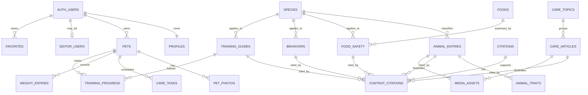

# Pawtome database, storage, and setup

## Runtime shape

Pawtome uses Next.js Server Components to read the published catalog and passes serializable records to the preserved client UI. When Supabase variables are absent, the repository returns the deterministic catalog from `lib/catalog.ts`; it does not fabricate credentials. Supabase Auth and database RLS remain the security boundary for private writes.

Translations are JSON objects keyed by `en-US`, `en-GB`, and `vi`; scientific names, DOI/PMID/canonical URLs, storage paths, and identifiers remain single non-translated values.

## Local application

1. Install Node.js 22.13 or newer.
2. Run `npm ci`.
3. Copy `.env.example` to `.env.local` only after a Supabase project exists.
4. Set only `NEXT_PUBLIC_SUPABASE_URL` and `NEXT_PUBLIC_SUPABASE_PUBLISHABLE_KEY`. Never put service-role, secret, database-password, or `POSTGRES_*` values in a browser-prefixed variable.
5. Run `npm test`, then `npm run dev`.

Without environment variables, public catalog browsing uses deterministic seed-equivalent data; account/private operations clearly report that Supabase is not configured.

## Vercel Marketplace and Supabase (manual external action)

The hosted Supabase project and Vercel integration already exist, but the hosted database is intentionally unchanged. Do not execute these steps against production without explicit approval:

1. Confirm the intended Vercel project and existing Supabase Marketplace connection.
2. Pull Development variables to ignored `.env.local`: `vercel env pull .env.local --environment=development`.
3. Confirm the public variable names match `.env.example`; keep any migration credential server-side and outside Git.
4. Run `npx supabase link --project-ref <confirmed-project-ref>`.
5. Review the migration, then apply it with `npx supabase db push`.
6. Seed only the intended non-production environment through an explicitly reviewed SQL workflow; never reset a hosted production database.
7. Grant the first editor by inserting their confirmed Auth UUID into `public.editor_users` through an admin-only SQL session. Users cannot self-grant this role.
8. Upload `public/brand/pawtome-logo.png` to `editorial-images/brand/pawtome-logo.png` only after confirming its rights record.

## Storage and upload boundary

- `editorial-images`: public read; editor-only create/update/delete.
- `pet-photos`: private; the first path segment must equal `auth.uid()`.
- Both buckets accept JPEG, PNG, and WebP only, up to 5 MiB.
- The browser helper discards the supplied filename, validates type/size, and creates `<user UUID>/<random UUID>.<safe extension>`.
- The `pet_photos` row uses a composite `(pet_id, owner_id)` foreign key, preventing a user from attaching a photo record to another user's pet.
- Private reads use authenticated Storage access or signed URLs; no public pet-photo URL is stored.

## Migration and authorization validation

- `npm run seed:generate` deterministically regenerates `supabase/seed.sql`.
- `npm run seed:validate` verifies counts, citation references, required tables, RLS enablement, essential policies, and claim-level seed links.
- `supabase/tests/rls.sql` is a pgTAP suite for anonymous, owner, other-owner, and editor boundaries.
- On 2026-08-14, `supabase db reset --local` recreated Postgres, applied `202608140001_initial_pawtome.sql`, loaded `supabase/seed.sql`, and all eight pgTAP authorization checks passed. The app also rendered all 71 records through the local Supabase API. No hosted database was contacted.

## Rollback

The migration is intentionally forward-only. Before any remote apply, create a Supabase backup or branch. If validation fails, discard the local database with `npx supabase stop --no-backup` and restart/reset it. Do not hand-author a destructive production rollback without a reviewed backup and migration plan.
